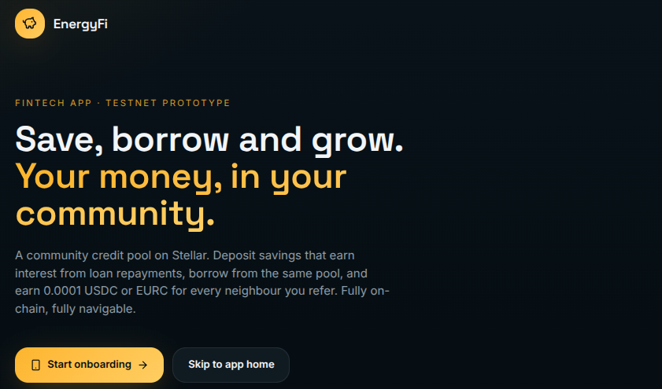
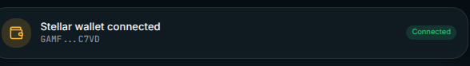
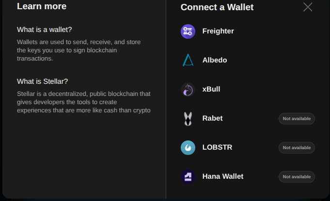
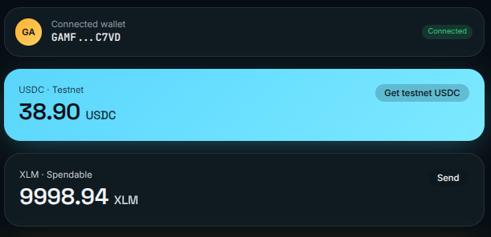
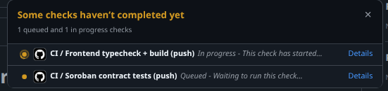
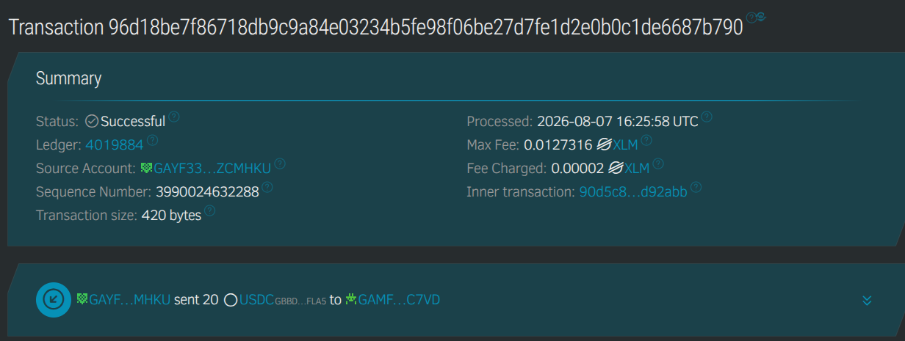
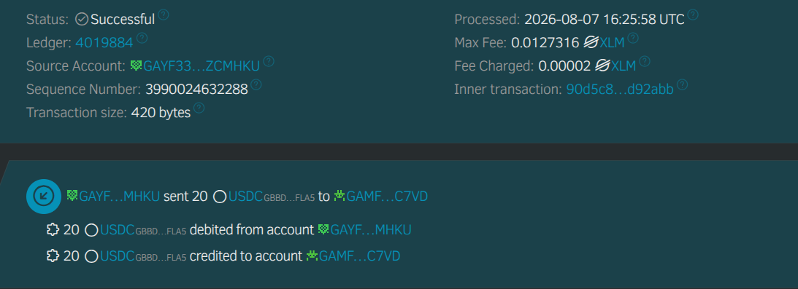
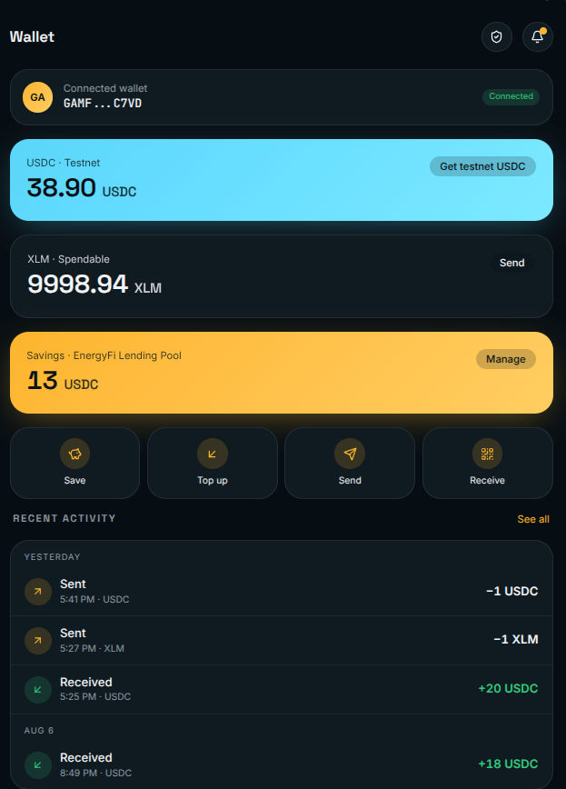

# EnergyFi-Network

Community energy finance on Stellar — savings, lending, and referral rewards built as a
family of Soroban smart contracts, with a web frontend that talks to them directly on
testnet.


## What it does

- **Savings pool** (`project`): a community lending pool with a fixed 1 USDC share price.
  Savers invest, the pool's only income is _real_ revenue — automatically routed saver
  interest from loan repayments (plus optional manual top-ups) — and dividends are claimed
  pro-rata from what the pool actually holds. Shares are permanently locked (no
  withdrawals): that permanence is what makes the soft-collateral pledge work.
- **Installment loans** (`installments`): pay-as-you-go loans (`loan_50` … `loan_500`) with
  soft-collateral underwriting — a borrower needs 25% of the principal in pool shares (a
  4× loan-to-savings cap), enforced on-chain at disbursal. Every `pay_installment` **routs
  the interest portion straight into the savings pool in the same transaction** (automatic,
  event-driven income — no admin courier). Default lifecycle: `mark_late` →
  `settle_default` (permanent flag) → `clear_default`. Providers withdraw settled principal
  minus a 1% platform fee.
- **Referral rewards** (`referral`): usage-gated payouts (a referee's own wallet must
  `confirm_usage`), with sybil guards (self-referral blocked, one referrer per referee,
  max 5 referees).
- **Energy credits** (`energy-credit`): buy kWh credits (1.5 USDC per kWh) for community
  energy settlements.

A full security model (auth, pledge integrity, routing solvency, rounding, events,
limitations) is documented in [`contracts/README.md`](contracts/README.md),
and the underwriting economics in [`docs/UNDERWRITING.md`](docs/UNDERWRITING.md).

## LIVE DEMO LINK

[Demo Link Website](https://energy-fi-network.vercel.app/)

## Layout

```
├── contracts/            # Soroban contracts (project, installments, referral, energy-credit)
│   └── README.md         # contract docs + exhaustive security model + deploy addresses
├── dev-server/           # web frontend + dev tooling
│   ├── src/              # React app (savings pool, loans & defaults, referral, credits)
│   │   └── lib/energyfi/ # config (contract IDs), pool-events, hooks, rpc
│   ├── packages/         # generated TypeScript clients for the contracts
│   └── scripts/          # seed-onchain, e2e smoke, referral demo
└── docs/UNDERWRITING.md  # lending & underwriting design
```

## Live on testnet (2026-08-07)

| Contract      | Version | Address                                                    |
| ------------- | ------- | ---------------------------------------------------------- |
| installments  | v7      | `CCVXQOOJCHVQVR7VQZJNN7QAZDJ6772GMFPI2XQI2LL7QEYQRURL44LM` |
| project       | v2      | `CDIMAD6UA6MEF7NMBPSEELU5PNUFNSOL72YJXN2DUPMFRPBIDYBSNTAA` |
| referral      | v2      | `CBURYW3CWH7L3R3RUADXCRNOQIOSKJEGDTBT5PPLS3ZMHKXCXDYFABAE` |
| energy-credit | v1      | `CB56C2Z5LN5ACMY4T4GIVETTNJLNUMMSWSI4UEEZNP5KCBFOJ3PBM7YC` |

## Verified contract call (2026-08-07)

A live `payoff_loan` call against the installments contract, verifiable on
[StellarExpert](https://stellar.expert/explorer/testnet/tx/fdfbb3f10be2d0be740d5180144d20fdae7a29a0a8fe6360975564e10c944498):

- **Transaction hash:** `fdfbb3f10be2d0be740d5180144d20fdae7a29a0a8fe6360975564e10c944498`
- **Contract:** `CCVXQOOJCHVQVR7VQZJNN7QAZDJ6772GMFPI2XQI2LL7QEYQRURL44LM` (installments v7)
- **Function:** `payoff_loan(buyer, "loan_50")` — borrower `GAMFAIXVHC…C7VD` settled the
  remaining 11 installments of a 50 USDC loan (12/12 paid, 55.2 USDC total: 50 principal
  - 5.2 interest auto-routed to the savings pool)
- **Ledger:** 4008384 · protocol 27 · successful

Earlier in the same roundtrip: `start_financing`
(`a454d087c2f96629c2905e1696faea62e9f03a23f408f106a9cb7b2fad7d18c4`) and `pay_installment`
(`028a9cc1b1208b58ae6da139c51437163fcd3660a87520baca1c23c72ecec6ef`), both also
verifiable on StellarExpert.

## End-to-end demo — what you see in the admin console (verified 2026-08-06)

The borrow loop runs on testnet and can be followed live in the admin console. Here is
exactly what happens, from a real run:

1. **Safer invests.** Admin deposits 1 USDC into the pool → 1 pool share (shares are
   permanently locked; that permanence backs the soft-collateral rule).
2. **A borrower takes a loan.** The E2E borrower pledges 13 USDC (13 shares; 14 total)
   and is disbursed a **50 USDC** `loan_50`: `total_shares=14`, each share 1 USDC.
   That "Neighbourhood loan · 50" row in the console is this loan.
3. **Every `4.6 USDC` installment is split by the contract:**
   `4.166667` principal → corpus (provider-withdrawable), `0.433333` interest →
   **auto-routed into the savings pool in the same transaction** (no admin courier).
   The admin's 1 share earns a pro-rated slice: `floor(0.433333 / 14) ≈ 0.309` per
   installment, claimable from the pool ("claim interest").
4. **Provider withdrawal** takes settled corpus minus a **1% platform fee**; the fee
   collects in a vault the admin can `claim_fees` from.
5. **Default lifecycle:** `mark_late` → `settle_default` (permanently flags the borrower;
   `check_eligibility` rejects them with `defaulted=true`) → `clear_default` (documented
   admin override).

After a full run: escrow funded 50 → disbursed → 2 installments paid (outstanding
**45.4**), all settled corpus withdrawn, fee vault drained, `installments` contract
balances **0.0000**, pool USDC **14.8357**.

> Tip if the admin wallet looks "off": the same identity also receives testnet USDC from
> the Circle faucet (20 at a time) — faucet top-ups and interest claims live in the same
> wallet, so the wallet balance is not the pool economics. The on-chain pool/loan numbers
> above are the authoritative view.

## Running

```bash
# contracts
cd contracts
cargo test --workspace            # 44/44 tests across the four contracts

# frontend
cd dev-server
npm install
npm run dev
```

On-chain scripts need `DEPLOY_SECRET` (secret key of the `energyfi-deploy` identity, the
contracts' admin) and testnet USDC from the Circle faucet:

```bash
DEPLOY_SECRET=$(stellar keys secret energyfi-deploy) node scripts/e2e-borrow-loop.mjs
```

## Tests & CI

**44/44 contract unit tests pass** (3 energy-credit · 20 installments · 8 project · 13
referral) — see `contracts/README.md` §8 for the security-critical coverage list.

| Check                  | How to run                                 | Count     |
| ---------------------- | ------------------------------------------ | --------- |
| Soroban contract tests | `cargo test --workspace` (in `contracts/`) | 44 passed |
| Frontend typecheck     | `npx tsc --noEmit` (in `dev-server/`)      | 0 errors  |
| Frontend build         | `npm run build` (in `dev-server/`)         | passes    |

**CI/CD** runs every push to `main` and on pull requests via GitHub Actions
([`.github/workflows/ci.yml`](.github/workflows/ci.yml)): it installs Rust + the
`@stellar/stellar-sdk`-based frontend, then runs the contract test suite, the frontend
typecheck, and the production build. Status badge:

[](https://github.com/Mikey-222/EnergyFi-Network/actions/workflows/ci.yml)

## Screenshots

Drop the PNG files into `docs/screenshots/` with the names below and they appear
in this README automatically.

### Wallet connected



### Wallet options available

The app connects through Stellar Wallet Kit, so any Stellar wallet can be used:



### Balance displayed



### CI/CD pipeline running



### Successful testnet transaction



### Transaction result

The app shows the outcome of every signed operation — a success banner with the
transaction hash (linked to StellarExpert) on confirmations, or an error message
describing what failed, so the user always knows whether their transaction
landed on-chain.



### Mobile responsive UI



## Status

Live on Stellar testnet with soft-collateral underwriting and automatic saver-interest
routing shipped (2026-08-06). Not audited; not mainnet — see the contracts README for
known limitations and the roadmap.
